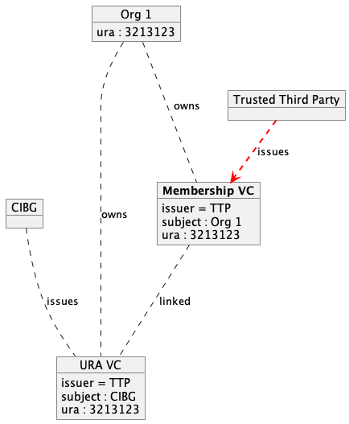
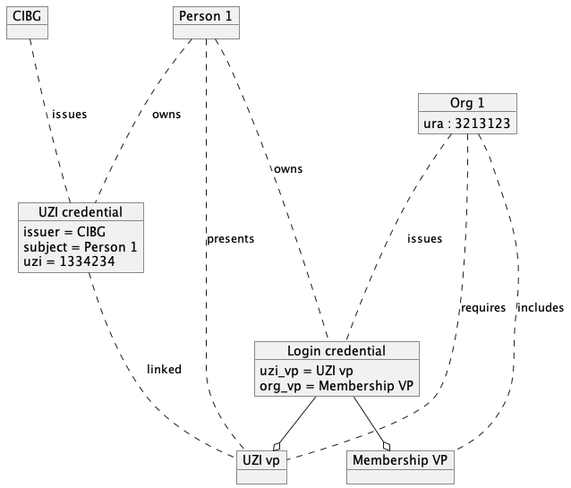
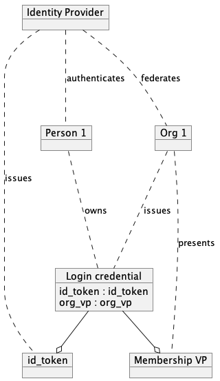

# Authentication 

## Authentication of organizations

Organizations become member of the network of organizations by the Trusted Third Party that issues a membership credential to the organization that is member of the network. Ideally, an organization would be able to identify itself by presenting some form of identification from a trusted source such as the Kamer van Koophandel (KvK) or an UZI attribute from GIBG. Once an organization has a membership to the network, it can present this credential as proof of membership and thereby authenticate its identity as part of the network. The Tusted Third Party is responsible for issuing these membership credentials.

Proposed credential name: OpenEhrOrgCredential

## Authentication of people

### Authentication with public trusted source

People are ideally identified by credentials that are published by trusted public sources like CIBG. In such a case a use would hold a credential in a private wallet and present such a credential on login at the healthcare system of the health care organization. On identification of the user, the organization creates a login credential that both contains the VP of the public trusted source about the user and a vp representing the identification of the organization.

### Authentication with an Identity Provider
Alternatively a OpenID Connect (OIDC) identity provider can be used. In this case the login credential contains the id_token of the OIDC login procedure.

