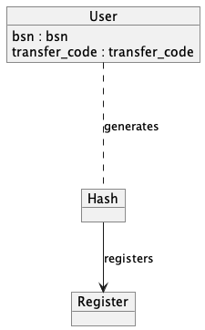

# Localization of both members and people

## Localization of network members
### Membership
The principle behind creating a network of trusted members is selecting a Trusted Third Party (TTP) that acts as gatekeeper to allow members on the network. Alongside, these memberships reflect the capabilities, such as `openEHR` and profiles, such as `ACP`.

Preferably, those memberships are founded by a trusted publicly issued attribute such as an URA number from CIBG.


### Registration & discovery

In order to keep track of the members in a network one or more registers are selected. Each member in the network registers itself at the registration endpoint by presenting a VP proving the membership. The registry periodically queries each member using ths Oid4VP protocol to affirm the members active status in the network. This register affords a form of discovery, as all members in the network are available in a database. This enables members of the network to run queries on the database. 


The register follows the pattern as described  by NUTS as part of the [discovery pattern](https://nuts-node.readthedocs.io/en/latest/pages/deployment/discovery.html).

### Querying for services
The network can be queried on their services. These queries are defined by the NUTS openapi specification.

### Example query
```cURL
GET /internal/discovery/v1/OpenEhrOrgCredential?query=credentialSubject.capabilities=openEHR&profiles=ACP
```
## Localizing patients in the network
### Basic principle
Finding where data op patients in the network resides is a complex challenge. On one side the information about patients must be shared, on the other side that information health care data that requires reticence. To resolve this challenge we get our inspiration from the concepts used in whitebox systems. 

The main principle is that a user that is published on the network gets a `transfer code` or `sharing code` that unlocks the discoverability of the person on the network. The main principle works like this:

```javascript
 published_hash = hash(social_security_number + transfer_code)
```

The `published_hash` is shared in the public registers. Only systems that have access to the `transfer code` and `bsn` are able to calculate the published_hash and query for the user. Systems or users that intercept the `published_hash` can't link this to actual personal data.



### A public registry as localizing data

With the basic concept in place, the localization service registers the following `patient data entries`:

- The value `published_hash`.
- Related profile, such as `ACP`.
- The identification of the data owner, probably the did:web.

The data owners publish about their data they want to share on the network, data requesters search on the `published_hash` to locate remote data. The one or more registries in the network keep their database up to date.

#### Further ideation
- Could VC / VPs be used to represent the `patient data entries`.

### End user experience & consent

The concept of `transfer code` or `sharing code` has some ramifications for the end-users of the system. The `transfer code` is _required_ to locate information. Without this code there is no transfer possible. 

The implications on the positive side is that the patients' consent is a central part of the sharing architecture. There users' consent thereby is deeply integrated into the process, the transfer of data is a step that is consciously made by the end-user and cannot be done without the users' consent.  

The implications in the negative side is that the patients' consent is a central part of the sharing architecture, without the `transfer code` there is no transfer possible; if the patient is not able to (re) produce the code, data becomes impossible to find. Use cases around ambulatory care and elderly care are not advisable with the concept of `transfer code`. A possible solution could be some method op obtaining the transfer codes in ambulatory situations.
